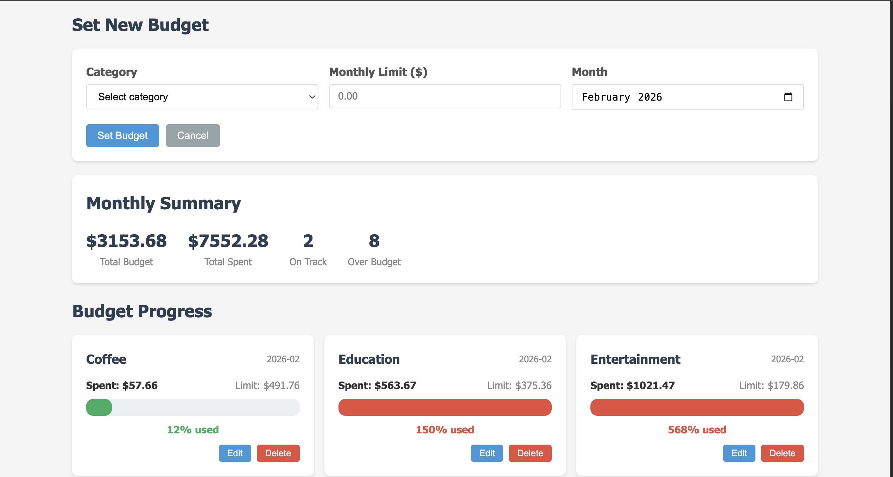
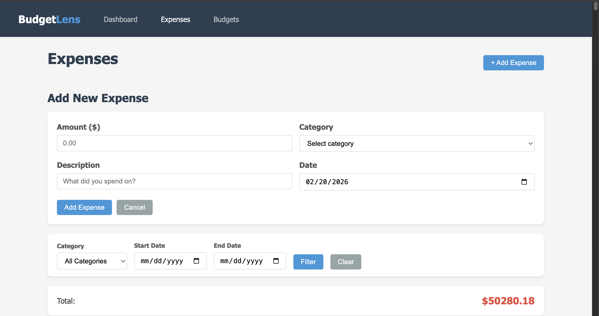

# BudgetLens - Stop Guessing Where Your Money Goes

## Author
**Kunal Sachin Takke** (Expense Management) & **Kunal Juvvala** (Budget Management)

## Class Link
[CS5610 - Web Development](https://northeastern.instructure.com/courses/245751)

## Project Objective
BudgetLens is a personal budget tracking application that helps users log expenses quickly, set category budgets, and get real-time visual feedback on their spending. The app provides color-coded progress bars, pie chart visualizations, and budget alerts to make financial awareness effortless.

Most people don't realize how much they spend on small purchases until it's too late. BudgetLens solves this by providing instant visual feedback through charts and progress bars, helping students manage tight budgets and families identify spending leaks.

## Screenshot





## Design Document
[Link to Design Document](docs/Design%20document%20Project%202%20Budget%20Lens.pdf)

## Demo Video
[Link to Demo Video](VIDEO_URL)

## Features
- **Expense Tracking**: Add, view, edit, and delete expenses with category, amount, description, and date
- **Budget Management**: Set monthly budgets per category with spending limits
- **Dashboard**: Overview with monthly spending totals, pie chart breakdown, recent expenses, and budget progress bars
- **Filtering**: Filter expenses by category and date range
- **Budget Alerts**: Color-coded warnings when approaching (80%) or exceeding budget limits
- **Monthly Summary**: Track total budget vs. spending across all categories

## Tech Stack
- **Backend**: Node.js + Express 5
- **Database**: MongoDB (native driver, no Mongoose)
- **Frontend**: Vanilla JavaScript (client-side rendering)
- **Charts**: Chart.js
- **Modules**: ES6 Modules throughout (no CommonJS)

## Instructions to Build

### Prerequisites
- Node.js (v18 or higher)
- MongoDB Atlas account or local MongoDB installation

### Setup

1. **Clone the repository**
   ```bash
   git clone <repo-url>
   cd BudgetLens
   ```

2. **Install dependencies**
   ```bash
   npm install
   ```

3. **Configure environment variables**

   Create a `.env` file in the root directory:
   ```
   MONGO_URI=mongodb+srv://<username>:<password>@<cluster>.mongodb.net/budgetlens
   PORT=3000
   ```

4. **Seed the database** (adds 1,050+ sample records)
   ```bash
   node --env-file=.env backend/seed.js
   ```

5. **Start the server**
   ```bash
   node --env-file=.env backend/app.js
   ```
   Or using npm:
   ```bash
   npm start
   ```

6. **Open in browser**

   Navigate to `http://localhost:3000`

### Usage
- **Dashboard** (`/`): View your financial overview with spending chart, recent expenses, and budget status
- **Expenses** (`/expenses.html`): Click "+ Add Expense" to log a new expense. Use filters to search by category or date range. Click "Edit" or "Delete" on any row to modify entries.
- **Budgets** (`/budgets.html`): Click "+ Set Budget" to create a monthly budget for a category. Monitor progress bars — green means on track, yellow means approaching limit (80%+), red means over budget.

## License
This project is licensed under the MIT License - see the [LICENSE](LICENSE) file for details.
